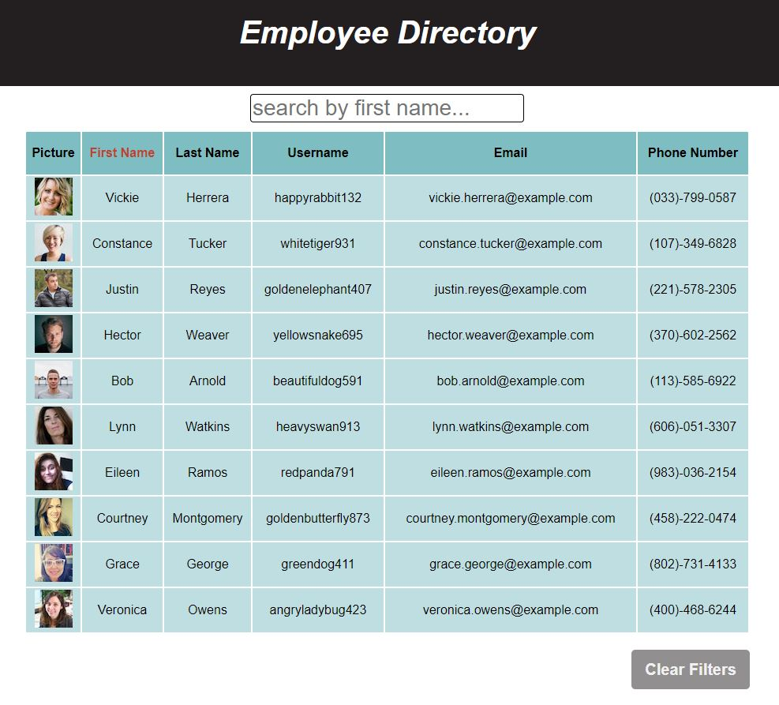

# React Employee Directory
## Completed by: 
### desasser

 

## Link: https://des-react-employee-directory.herokuapp.com/
## Repo: https://github.com/desasser/react-employee-directory

 
- - - - 

## Description: 
This project is an app for practice utilizing react.js library for building websites.

## Table of Contents: 
* [Installation](#installation)
* [Usage](#usage)
* [License](#license)
* [Contributing](#contributing)
* [Tests](#tests)
* [Questions](#questions)

## Screenshot

## Installation: 
This project is online and does not require any installation to function.

## Usage: 
This project is used for practice with React. It generates random employees and displays them with the ability to sort and search by first name.

## License: 
This project is covered under the MIT license. 

## Contributing: 
No contributions are necessary at this time.

## Tests: 
Load the app in your browser of choice and take it for a whirl.

## Questions:
* https://github.com/desasser
* desasser79@gmail.com

You can reach me via email at the above address with any additional questions, comments, or concerns regarding this project.